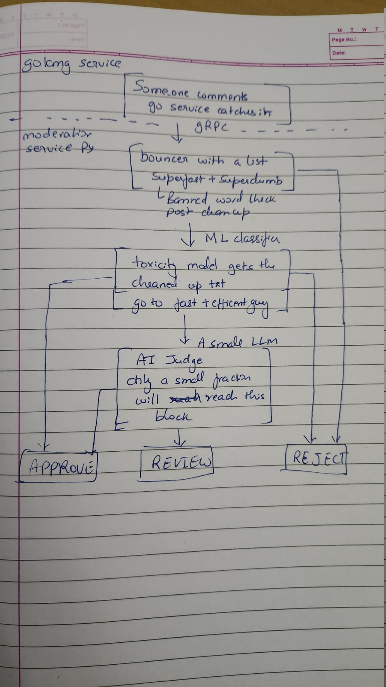

# Profanity Filter — POC

So this was a POC idea for a profanity filter in the comment section of the iLearn app that I was working on at ICICI Securities.

Ngl, this was as barebones as it could get, and honestly, it was supposed to be like this. This probably wouldn't get approved by the product team anyway, as it wouldn't justify the time it's going to take to build and maintain it at scale.

But yeah, it was something that brought together all the effort I put into NLP models for text classification during my undergrad, my dev skills, and, aside from all of that, I also got to delve into local LLMs.

Tbh, I think LLMs have great use cases in situations like this, but we need to do a compute cost vs. benefit analysis before blindly going the LLM way.

I'll be explaining the approach below diagrammatically and mentioning a few ideas I had to mid- to scale this for lakhs of users.

## The basic idea

"Great post, thanks" does not require any reasoning to clear. Sending the same comment to an LLM means you are paying for a judgement that you already knew.

Hence, each stage acts as a filter, not merely a step. Whatever it can resolve, it resolves. Only the remainder is passed ahead.

Coming to the cost part. Three stages, roughly 100x apart:

| Stage      | Cost per comment | Traffic it actually sees |
| ---------- | ---------------: | -----------------------: |
| Wordlist   |        ~1 ms CPU |                     100% |
| ONNX model |       ~15 ms CPU |                     ~40% |
| LLM        |         ~3 s GPU |                      ~5% |

## Improvements

LLMs are fucking slow, at least for our use cases.

A straightforward approach would be to use a GPU instead of CPU for inference, but even then, that would take close to half a second or so. This is honestly a very naive approach. Scaling GPUs is expensive too.

Maybe we could run the AI inference asynchronously and return a pending response, then resolve it in the background and update the status via polling. This would remove the timeout/deadline errors and avoid blocking the request.

Kafka could replace the in-process queue.

Use Redis to filter out repetitive profanity/spam.

User reputation could be another solution.

Human-in-the-loop.

Prometheus + Grafana for observability — per-stage latency, band distribution, queue depth, etc.

## At scale

Assume 1 lakh users, 50k comments a day, with peak traffic of 5–10 requests/sec. Our current build will unalive itself.

### Compute

**Go service:** 2–3 stateless replicas, trivial load.

**Python:** 4–6 replicas — ONNX is CPU-bound, ~1 core per 60 req/sec.

Llama Guard at 5% of 50k = ~2.5k calls/day, so 1 GPU instance or a hosted API.

**Postgres:** A single primary with a read replica is plenty.

### gRPC load balancing

With multiple Python replicas, you must configure `round_robin` — gRPC pins to one connection by default, and you'll see one pod at 100% while the rest sit idle.

### Storage

~50k comments + ~60k decision rows/day.

The decisions table grows the fastest; partition by month and archive to object storage after 90 days.

### Other things

* Rate limiting per user, ahead of everything.
* Human review team — even 1% flagged is 500/day.
* Retraining loop from human-reviewed labels.
* Audit retention for regulatory requests.
